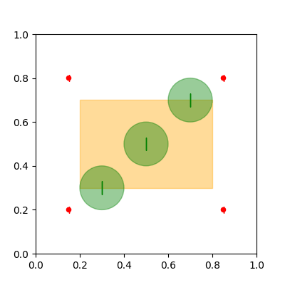
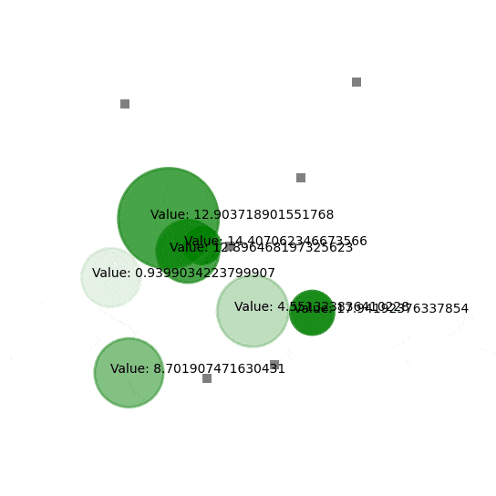
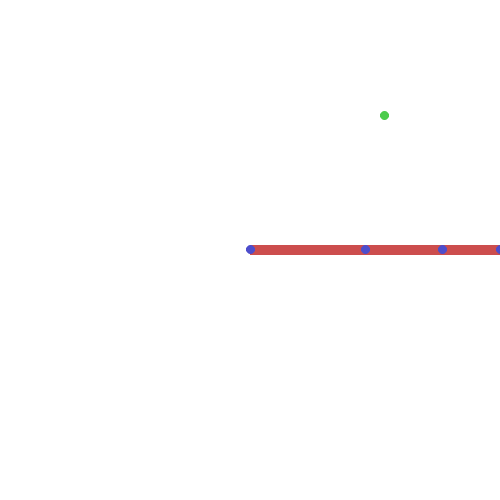
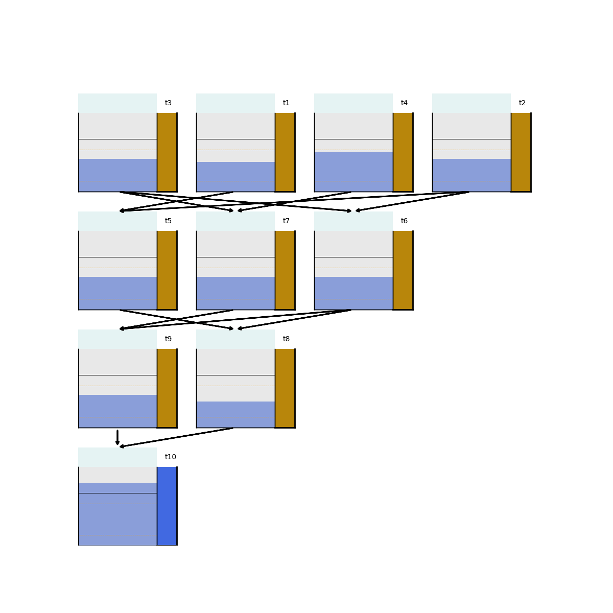

# pyRDDLGym-jax

**pyRDDLGym-jax (known in the literature as JaxPlan) is an efficient gradient-based/differentiable planning algorithm in JAX.** It provides:

1. automatic translation of any RDDL description file into a differentiable simulator in JAX
2. flexible policy class representations, automatic model relaxations for working in discrete and hybrid domains, and Bayesian hyper-parameter tuning.

Some demos of solved problems by JaxPlan:

<p align="middle">






</p>

> [!NOTE]  
> While JaxPlan can support some discrete state/action problems through model relaxations, on some discrete problems it can perform poorly (though there is an ongoing effort to remedy this!).
> If you find it is not making sufficient progress, check out the [PROST planner](https://github.com/pyrddlgym-project/pyRDDLGym-prost) (for discrete spaces) or the [deep reinforcement learning wrappers](https://github.com/pyrddlgym-project/pyRDDLGym-rl).

## Contents

- [Installation](#installation)
- [Running from the Command Line](#running-from-the-command-line)
- [Running from Another Python Application](#running-from-another-python-application)
- [Configuring the Planner](#configuring-the-planner)
- [Tuning the Planner](#tuning-the-planner)
- [Simulation](#simulation)
- [Citing JaxPlan](#citing-jaxplan)
  
## Installation

To use the compiler or planner without the automated hyper-parameter tuning, you will need the following packages installed: 
- ``pyRDDLGym>=2.0``
- ``tqdm>=4.66``
- ``jax>=0.4.12``
- ``optax>=0.1.9``
- ``dm-haiku>=0.0.10``
- ``tensorflow-probability>=0.21.0``

Additionally, if you wish to run the examples, you need ``rddlrepository>=2``. 
To run the automated tuning optimization, you will also need ``bayesian-optimization>=2.0.0``.

You can install JaxPlan with all requirements using pip:

```shell
pip install pyRDDLGym-jax[extra]
```

## Running from the Command Line

A basic run script is provided to run JaxPlan on any domain in ``rddlrepository`` from the install directory of pyRDDLGym-jax:

```shell
python -m pyRDDLGym_jax.examples.run_plan <domain> <instance> <method> <episodes>
```

where:
- ``domain`` is the domain identifier as specified in rddlrepository (i.e. Wildfire_MDP_ippc2014), or a path pointing to a valid ``domain.rddl`` file
- ``instance`` is the instance identifier (i.e. 1, 2, ... 10), or a path pointing to a valid ``instance.rddl`` file
- ``method`` is the planning method to use (i.e. drp, slp, replan)
- ``episodes`` is the (optional) number of episodes to evaluate the learned policy.

The ``method`` parameter supports three possible modes:
- ``slp`` is the basic straight line planner described [in this paper](https://proceedings.neurips.cc/paper_files/paper/2017/file/98b17f068d5d9b7668e19fb8ae470841-Paper.pdf)
- ``drp`` is the deep reactive policy network described [in this paper](https://ojs.aaai.org/index.php/AAAI/article/view/4744)
- ``replan`` is the same as ``slp`` except the plan is recalculated at every decision time step.
   
For example, the following will train JaxPlan on the Quadcopter domain with 4 drones:

```shell
python -m pyRDDLGym_jax.examples.run_plan Quadcopter 1 slp
```

## Running from Another Python Application

To run JaxPlan from within a Python application, refer to the following example:

```python
import pyRDDLGym
from pyRDDLGym_jax.core.planner import JaxBackpropPlanner, JaxOfflineController

# set up the environment (note the vectorized option must be True)
env = pyRDDLGym.make("domain", "instance", vectorized=True)

# create the planning algorithm
planner = JaxBackpropPlanner(rddl=env.model, **planner_args)
controller = JaxOfflineController(planner, **train_args)

# evaluate the planner
controller.evaluate(env, episodes=1, verbose=True, render=True)
env.close()
```

Here, we have used the straight-line controller, although you can configure the combination of planner and policy representation if you wish. 
All controllers are instances of pyRDDLGym's ``BaseAgent`` class, so they provide the ``evaluate()`` function to streamline interaction with the environment.
The ``**planner_args`` and ``**train_args`` are keyword argument parameters to pass during initialization, but we strongly recommend creating and loading a config file as discussed in the next section.

## Configuring the Planner

The simplest way to configure the planner is to write and pass a configuration file with the necessary [hyper-parameters](https://pyrddlgym.readthedocs.io/en/latest/jax.html#configuring-pyrddlgym-jax).
The basic structure of a configuration file is provided below for a straight-line planner:

```ini
[Model]
logic='FuzzyLogic'
comparison_kwargs={'weight': 20}
rounding_kwargs={'weight': 20}
control_kwargs={'weight': 20}

[Optimizer]
method='JaxStraightLinePlan'
method_kwargs={}
optimizer='rmsprop'
optimizer_kwargs={'learning_rate': 0.001}

[Training]
key=42
epochs=5000
train_seconds=30
```

The configuration file contains three sections:
- ``[Model]`` specifies the fuzzy logic operations used to relax discrete operations to differentiable approximations; the ``weight`` dictates the quality of the approximation,
and ``tnorm`` specifies the type of [fuzzy logic](https://en.wikipedia.org/wiki/T-norm_fuzzy_logics) for relacing logical operations in RDDL (e.g. ``ProductTNorm``, ``GodelTNorm``, ``LukasiewiczTNorm``)
- ``[Optimizer]`` generally specify the optimizer and plan settings; the ``method`` specifies the plan/policy representation (e.g. ``JaxStraightLinePlan``, ``JaxDeepReactivePolicy``), the gradient descent settings, learning rate, batch size, etc.
- ``[Training]`` specifies computation limits, such as total training time and number of iterations, and options for printing or visualizing information from the planner.

For a policy network approach, simply change the ``[Optimizer]`` settings like so:

```ini
...
[Optimizer]
method='JaxDeepReactivePolicy'
method_kwargs={'topology': [128, 64], 'activation': 'tanh'}
...
```

The configuration file must then be passed to the planner during initialization. 
For example, the [previous script here](#running-from-another-python-application) can be modified to set parameters from a config file:

```python
from pyRDDLGym_jax.core.planner import load_config

# load the config file with planner settings
planner_args, _, train_args = load_config("/path/to/config.cfg")
    
# create the planning algorithm
planner = JaxBackpropPlanner(rddl=env.model, **planner_args)
controller = JaxOfflineController(planner, **train_args)
...
```

### Tuning the Planner

It is easy to tune the planner's hyper-parameters efficiently and automatically using Bayesian optimization.
To do this, first create a config file template with patterns replacing concrete parameter values that you want to tune, e.g.:

```ini
[Model]
logic='FuzzyLogic'
comparison_kwargs={'weight': #weight}
rounding_kwargs={'weight': #weight}
control_kwargs={'weight': #weight}

[Optimizer]
method='JaxStraightLinePlan'
method_kwargs={}
optimizer='rmsprop'
optimizer_kwargs={'learning_rate': #lr}

[Training]
train_seconds=30
print_summary=False
print_progress=False
train_on_reset=True
```

would allow to tune the ``#weight`` sharpness of model relaxations, and the ``#lr`` learning rate of the optimizer.

Next, you must link the patterns in the config with concrete hyper-parameter ranges the tuner will understand:

```python
import pyRDDLGym
from pyRDDLGym_jax.core.tuning import JaxParameterTuning, Hyperparameter

# set up the environment   
env = pyRDDLGym.make(domain, instance, vectorized=True)
    
# load the config file template with planner settings
with open('path/to/config.cfg', 'r') as file: 
    config_template = file.read() 
    
# map parameters in the config that will be tuned
def power_10(x):
    return 10.0 ** x
    
hyperparams = [
    Hyperparameter('#weight', -1., 5., power_10),  # tune #weight from 10^-1 ... 10^5
    Hyperparameter('#lr', -5., 1., power_10),   # tune #lr from 10^-5 ... 10^1
]
    
# build the tuner and tune
tuning = JaxParameterTuning(env=env,
                            config_template=config_template,
                            hyperparams=hyperparams,
                            online=False,
                            eval_trials=trials,
                            num_workers=workers,
                            gp_iters=iters)
tuning.tune(key=42, log_file='path/to/log.csv')
```
 
A basic run script is provided to run the automatic hyper-parameter tuning for the most sensitive parameters of JaxPlan:

```shell
python -m pyRDDLGym_jax.examples.run_tune <domain> <instance> <method> <trials> <iters> <workers>
```

where:
- ``domain`` is the domain identifier as specified in rddlrepository
- ``instance`` is the instance identifier
- ``method`` is the planning method to use (i.e. drp, slp, replan)
- ``trials`` is the (optional) number of trials/episodes to average in evaluating each hyper-parameter setting
- ``iters`` is the (optional) maximum number of iterations/evaluations of Bayesian optimization to perform
- ``workers`` is the (optional) number of parallel evaluations to be done at each iteration, e.g. the total evaluations = ``iters * workers``.
 

## Simulation

The JAX compiler can be used as a backend for simulating and evaluating RDDL environments:

```python
import pyRDDLGym
from pyRDDLGym.core.policy import RandomAgent
from pyRDDLGym_jax.core.simulator import JaxRDDLSimulator

# create the environment
env = pyRDDLGym.make("domain", "instance", backend=JaxRDDLSimulator)

# evaluate the random policy
agent = RandomAgent(action_space=env.action_space, num_actions=env.max_allowed_actions)
agent.evaluate(env, verbose=True, render=True)
```

For some domains, the JAX backend could perform better than the numpy-based one, due to various compiler optimizations. 
In any event, the simulation results using the JAX backend should (almost) always match the numpy backend.


## Citing JaxPlan

The [following citation](https://ojs.aaai.org/index.php/ICAPS/article/view/31480) describes the main ideas of JaxPlan. Please cite it if you found it useful:

```
@inproceedings{gimelfarb2024jaxplan,
    title={JaxPlan and GurobiPlan: Optimization Baselines for Replanning in Discrete and Mixed Discrete and Continuous Probabilistic Domains},
    author={Michael Gimelfarb and Ayal Taitler and Scott Sanner},
    booktitle={34th International Conference on Automated Planning and Scheduling},
    year={2024},
    url={https://openreview.net/forum?id=7IKtmUpLEH}
}
```

Some of the implementation details derive from the following literature, which you may wish to also cite in your research papers:
- [A Distributional Framework for Risk-Sensitive End-to-End Planning in Continuous MDPs](https://ojs.aaai.org/index.php/AAAI/article/view/21226)
- [Deep reactive policies for planning in stochastic nonlinear domains, AAAI 2019](https://ojs.aaai.org/index.php/AAAI/article/view/4744)
- [Scalable planning with tensorflow for hybrid nonlinear domains, NeurIPS 2017](https://proceedings.neurips.cc/paper/2017/file/98b17f068d5d9b7668e19fb8ae470841-Paper.pdf)

